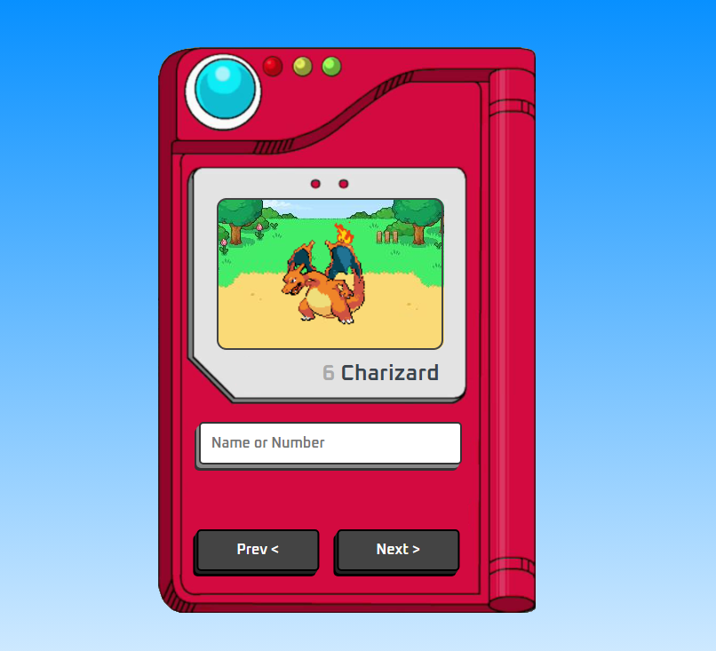

# POKEDEX
-> Um projeto que de inicio pode até parecer simples, porém trás vários conceitos importantes de programção e que me testou bastante. O programa consome uma api e vem com barra de pesquisa(nome, id) e trás uma animação do pokemon contendo também outras funcionalidades.

